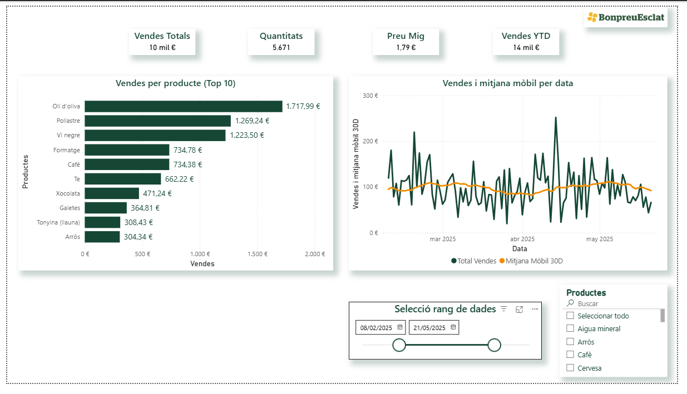

# Bonpreu Data Engineer Demo

Aquest projecte és una **demo de pipeline ETL (Extract, Transform, Load)** creada per mostrar coneixements clau en el rol d’**Enginyer de Dades** a Bon Preu S.A.U.

---

## 🎯 Objectiu del projecte
- **Extract**: obtenir dades de vendes des d’un fitxer CSV.  
- **Transform**: netejar i enriquir les dades (per ex., càlcul de totals).  
- **Load**: carregar les dades en una base de dades MySQL.  
- **Visualització**: connectar MySQL a Power BI per crear dashboards.  
- **Bones pràctiques**: ús de tests automàtics, Docker i CI/CD (GitHub Actions).  

---

## 📂 Estructura del projecte

```
bonpreu-data-engineer-demo/
├─ data/
│   └─ input.csv          # Dataset fals amb dades de vendes
├─ etl/
│   └─ etl_main.py        # Script principal ETL
├─ tests/
│   └─ test_etl.py        # Tests automàtics amb pytest
├─ .github/
│   └─ workflows/
│       └─ ci.yml         # Workflow GitHub Actions (CI/CD)
├─ .dockerignore
├─ .env.example           # Exemple de variables d’entorn
├─ docker-compose.yml     # Per aixecar MySQL + ETL amb Docker
├─ Dockerfile             # Construcció de la imatge ETL
├─ requirements.txt       # Dependències Python
└─ README.md
```

---

## 🚀 Execució local

1. Crear entorn virtual i instal·lar dependències:
```bash
python3 -m venv venv
source venv/bin/activate
pip install -r requirements.txt
```
2.	Executar l’ETL:
```bash
python etl/etl_main.py
```

3.	Executar tests:
```bash
pytest tests/
```
## 🐳 Execució amb Docker

Construir i executar el contenidor de l’ETL:
```bash
docker build -t bonpreu-etl-demo .
docker run --rm bonpreu-etl-demo
```
## 🐙 Execució amb Docker Compose (MySQL + ETL)

Requisit previ: crear .env a partir de .env.example
```bash
cp .env.example .env
# (opcional) editar credencials si cal
docker compose up --build
```
	•	Això aixeca un contenidor amb MySQL i executa l’ETL.
	•	Si vols carregar dades a MySQL, descomenta la crida load(df) al fitxer etl/etl_main.py.

✅ Tests

Aquest projecte inclou tests bàsics amb pytest.
S’executen tant localment com automàticament amb GitHub Actions en cada push.

```bash
pytest tests/
```
🐙 CI/CD amb GitHub Actions

El workflow es troba a .github/workflows/ci.yml i executa:
	•	Instal·lació de dependències
	•	Execució de tests
	•	Construcció de la imatge Docker

A la pestanya Actions de GitHub es poden veure els resultats de cada build.

⸻

📊 Dashboard Power BI

El projecte inclou un dashboard connectat a la taula sales_staging de MySQL.
	•	Podeu trobar l'arxiu Power BI en el següent enllaç d'aquest repositori Github:
	https://github.com/rogerloop/bonpreu-data-engineer-demo/blob/main/powerBI/Bon%20Preu%20Dashboard.pbix

Captura del dashboard (exemple)



(pendent de finalitzar més captures)


Exemples de visuals: (pendent finalitzar)

	•	Gràfic de barres → vendes totals per producte
	•	Gràfic de línies → evolució de vendes per data
	•	KPI → suma de total (ingressos)


⸻

🔗 Recursos i eines utilitzades
	•	Python Pandas
	•	SQLAlchemy
	•	MySQL
	•	Docker
	•	GitHub Actions
	•	Power BI

⸻

👨‍💻 Autor

Roger Defez
📍 Osona
LinkedIn | GitHub
