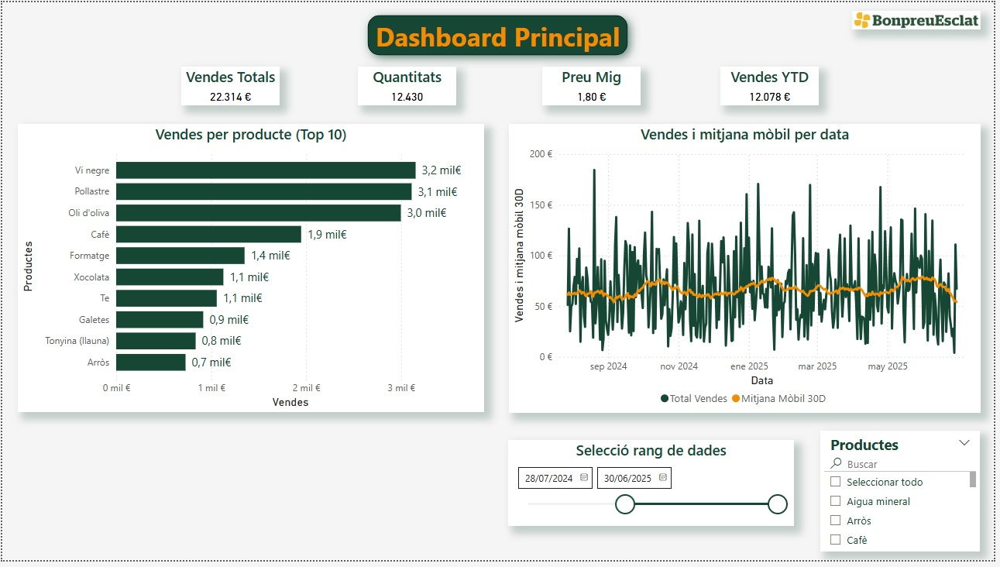
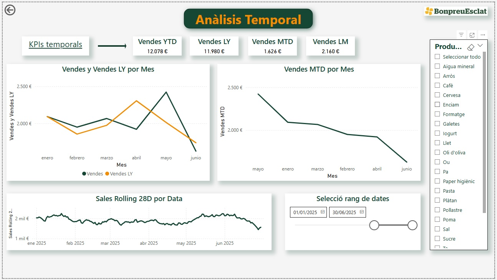

# Bonpreu Data Engineer Demo

📄 Versions: [English](README_EN.md) | [Català](README.md)

Aquest projecte és una **demo de pipeline ETL (Extract, Transform, Load)** creada per mostrar coneixements clau en el rol d’**Enginyer de Dades** a Bon Preu S.A.U.

---

## 🎯 Objectiu del projecte
- **Extract**: obtenir dades de vendes des d’un fitxer CSV.  
- **Transform**: netejar i enriquir les dades (per ex., càlcul de totals).  
- **Load**: carregar les dades en una base de dades MySQL.  
- **Visualització**: connectar MySQL a Power BI per crear dashboards.  
- **Bones pràctiques**: ús de tests automàtics, Docker i CI/CD (GitHub Actions).  

---

## 🛠 Reptes trobats i resolts
- Desenvolupament inicial en mac xip M3 **MacOS amb VSC i Docker Desktop**.  
- Power BI només funciona a Windows → Al no tenir PC vaig usar un **Mac antic amb Windows 10 en BootCamp**.  
- Docker no funcionava bé en aquest entorn → vaig aixecar una **màquina Ubuntu amb VirtualBox**.  
- Allà vaig desplegar MySQL via Docker Compose i vaig connectar-lo a Power BI a Windows.  
- Va ser necessari configurar correctament Power Query per netejar i importar les dades.  

Aquest procés reflecteix adaptabilitat i resolució de problemes en entorns mixtos.

---

## 📂 Estructura del projecte

```
bonpreu-data-engineer-demo/
├─ data/
│   └─ input.csv              # Dataset fals amb dades de vendes (2.000 registres)
├─ etl/
│   └─ etl_main.py            # Script principal ETL
├─ tests/
│   └─ test_etl.py            # Tests automàtics amb pytest
├─ powerBI/
│   ├─ Bon Preu Dashboard.pbix    # Dashboard complet Power BI
│	├─ Bbonpreu-theme.json		  # "theme" corporatiu Bon Preu per importar a Power BI
│   ├─ Power_BI_Dashboard_p1.jpg
│   ├─ Power_BI_Dashboard_p2.jpg
│   ├─ Power_BI_Dashboard_p3.jpg
│   └─ Power_BI_DAX.jpg
├─ .github/
│   └─ workflows/
│       └─ ci.yml             # Workflow GitHub Actions (CI/CD)
├─ .dockerignore
├─ .gitignore
├─ .env.example               # Exemple de variables d’entorn
├─ docker-compose.yml         # Per aixecar MySQL + ETL amb Docker
├─ Dockerfile                 # Construcció de la imatge ETL
├─ requirements.txt           # Dependències Python
├─ generate_data.py           # Script Python per generar automàticament quan es desitgi, el input.csv amb dades sintètiques
├─ wait-for-db.sh             # Script de sistema - evita que docker-compose.yml executi ETL abans que respongui MySQL
└─ README.md
```

---

## 🧑🏽‍💻 Com arrencar o visualitzar el prjecte (Guia pas a pas)

### 1️⃣ Descàrrega del projecte (clone)
**Directori on posar el projecte, per exemple Documents - Clonar el repositori (usa l'enllaç) - Entrar al directori del projecte**
```bash
cd ~/Documents
git clone https://github.com/rogerloop/bonpreu-data-engineer-demo.git
cd bonpreu-data-engineer-demo
```

### 2️⃣ Preparar el fitxer .env (important)
Al repo trobarás un fitxer .env.exemple, localment has de crear un .env a partir de l’exemple perquè les connexions (MySQL, etc.) funcionin. Canviant de nom l'existent o copiant i donant-li nom .env (a continuació exemple per fer-ho)

macOS / Linux
```bash
cp .env.example .env
```
Windows (CMD)
```bash
copy .env.example .env
```
Windows (PowerShell)
```bash
Copy-Item .env.example .env
```

Després si es vol o necesita editar .env amb un editor de text (Visual Studio Code, Notepad, nano…) i posar les credencials reals o les que es vulgui per fer proves. (Important, aquest fitxer .env s'ha d'incloure a .gitignore i no s'ha de pujar mai a Github)

### 3️⃣ Triar la modalitat d’execució
Triar una de les tres modalitats d'execució del projecte.
- **Opció A — Execució local (Python venv):** millor si es vol personalitzar instal·lació o modificar parts del codi.
- **Opció B — Docker (ETL en contenidor):** bo si no es vol instal·lar Python local; només és necessari Docker. Recomanat per provar ETL aïllat.
- **Opció C — Docker Compose (recomanat per demo completa):** aixeca MySQL + ETL amb 1 comanament. Recomanat si es vol que es reprodueixi la demo exactament. 

## 🚀 Opció A — Execució local

1. Crear entorn virtual i instal·lar dependències:
```bash
python3 -m venv venv
source venv/bin/activate
pip install -r requirements.txt
```
2.	Executar l’ETL:
```bash
python etl/etl_main.py
```

3.	Executar tests:
```bash
pytest tests/
```
## 🐳 Opció B — Execució amb Docker (ETL en contenidor)

Construir i executar el contenidor de l’ETL:
```bash
docker build -t bonpreu-etl-demo .
docker run --rm bonpreu-etl-demo
```
## 🐙 Opció C — Execució amb Docker Compose (MySQL + ETL)

Requisit previ: crear .env a partir de .env.example
```bash
cp .env.example .env
# (opcional) editar credencials si cal
docker compose up --build
```
	•	Això aixeca un contenidor amb MySQL i executa l’ETL.
	•	Si no vols carregar dades a MySQL, comenta la crida load(df) al fitxer etl/etl_main.py.

---

### ✅ Tests

Aquest projecte inclou tests bàsics amb pytest.
S’executen tant localment com automàticament amb GitHub Actions en cada push.

```bash
pytest tests/
```

---

### 🐙 Automatització CI/CD amb GitHub Actions

El workflow es troba a .github/workflows/ci.yml i executa:

	•	Instal·lació de dependències
	•	Execució de tests
	•	Construcció de la imatge Docker

A la pestanya Actions de GitHub es poden veure els resultats de cada build.

⸻

### 📊 Dashboard Power BI (Només disponible a Windows)

El projecte inclou un dashboard connectat a la taula sales_staging de MySQL.
	• Podeu trobar l'arxiu Power BI en el següent enllaç d'aquest repositori Github:
	[Descarrega Power BI demo BonPreu](https://github.com/rogerloop/bonpreu-data-engineer-demo/blob/main/powerBI/Bon%20Preu%20Dashboard.pbix)

Recordatori: Si es fan modificacions a l'arxiu .env i a les dades de conexió de MySQL s'haurà de modificar les dades de conexió al Power BI si es volen fer actualitzacions mitjançant Power Query

Adjunto captura del dashboard (exemple)
Exemples de visuals:

	•	Gràfic de barres → vendes totals per producte
	•	Gràfic de línies → evolució de vendes per data
	•	KPI → suma de total (ingressos)
	•	Exemple DAX - Creació taula Calendar per treballar amb temps intel·ligent
	







⸻

### 🔗 Recursos i eines utilitzades
	•	Python Pandas
	•	SQLAlchemy
	•	MySQL
	•	Docker
	•	GitHub Actions
	•	Power BI

⸻

👨‍💻 Autor

Roger Defez
📍 Osona
[LinkedIn](https://www.linkedin.com/in/roger-defez/) | [GitHub](https://github.com/rogerloop)
